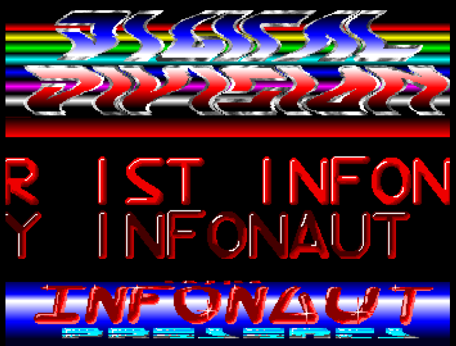
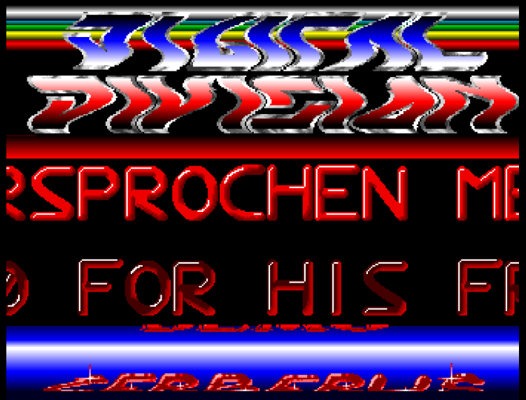
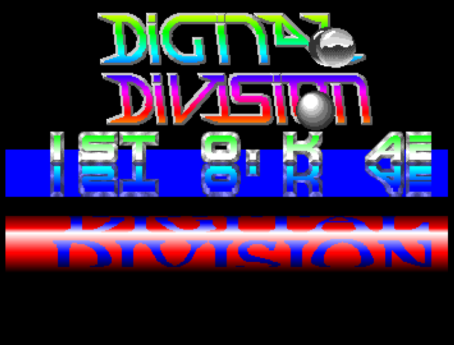
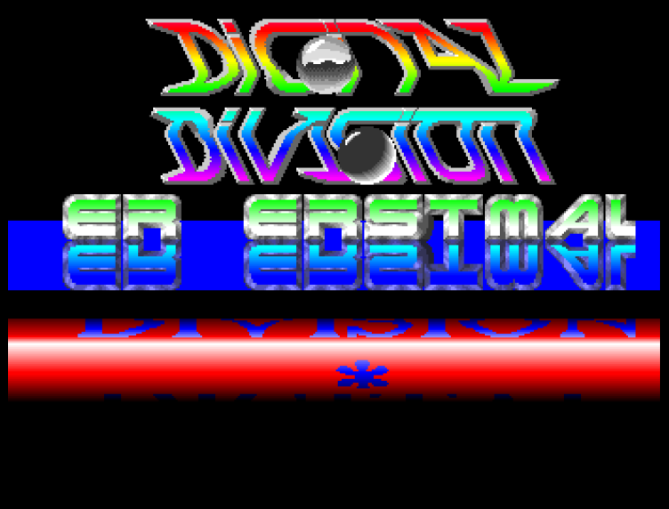

# AmigaIntros
Code of very old Intros restored from Amiga floppies:
* asm/INTRO2 oldschool amiga demo with two scrollers and user controls

   

* asm/INTRO3 oldschool amiga demo with user controlled logo-wobble

   

* gfabasic/PushAndMove Sokoban clone

* gfabasic/PONG Pong clone

* gfabasic/SPACEWAR  spacewar clone

The screenshots were taken in FS-UAE (A500) from the sources assembled with vasm.
For INTRO3 the data files had to be re-laid out to match the source: the source expects
`logo.iot3` as three 320x256 bitplanes followed by the palette and `lauf` with 42 bytes per row,
the files in this repository are a 110 line logo and a 40 bytes per row picture.
